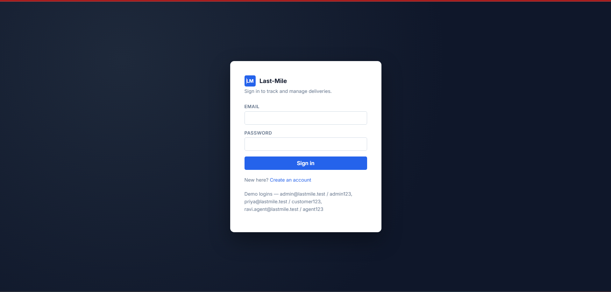
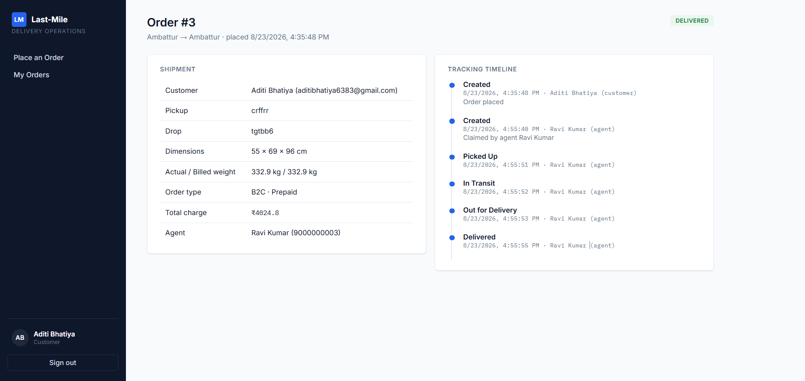
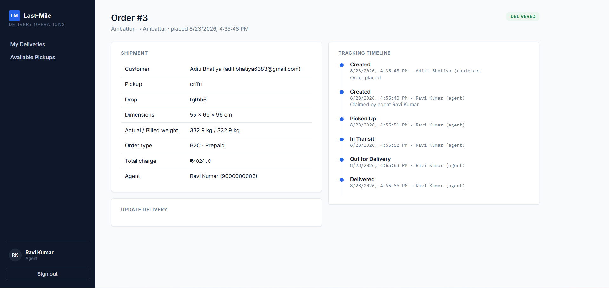

# Last-Mile Delivery Tracker

I built this to answer a fairly ordinary logistics problem the "right" way: customers place orders, the app tells them exactly what it'll cost before they commit to anything, a delivery agent gets matched to the order (by an admin, automatically, or by grabbing it themselves), and everyone — customer, agent, admin — stays in the loop as the package moves from pickup to doorstep.

Nothing exotic under the hood. Node/Express on the backend, React on the front, SQLite in between so there's no database server to fuss with. The interesting part isn't the tech stack, it's getting the rate math and the status lifecycle actually right, which is where most of the thinking went.

This README is written the way I'd actually explain the project to someone joining the repo — what's here, why I built it this way, and how to get it running without guessing.

**Quick heads-up if you're testing more than one role at once:** each browser tab keeps its own login (sessions live in `sessionStorage`, not `localStorage`), so you can be a customer in one tab and an agent in another, side by side. Just don't try to be two people in the same tab without signing out first.

---

## Screenshots

Here's the app actually running, walking through one full order end to end.

**Signing in**



**A customer tracking their order — delivered, full timeline**



**The same order from the delivery agent's side**



Notice the timeline matches on both sides — every status change (claimed, picked up, in transit, out for delivery, delivered) is logged with a timestamp and who did it, and both the customer and the agent are looking at the exact same audit trail, just with different action buttons available depending on the role.

_A few more screens I haven't captured yet — the customer's Place an Order screen with a live price quote, the agent's Available Pickups list, and the admin's Zones/Rate Cards screens. Same process as above: capture, save into `screenshots/` with a sensible filename, add an `` line here, push._

---

## What's actually in here

- **`backend/`** — a Node.js + Express API, backed by SQLite (via `better-sqlite3`). The whole database is one file — nothing to install, nothing to configure beyond an env file.
- **`frontend/`** — a React app (Vite) with three different experiences behind one login: customer, delivery agent, and admin.

I kept inline comments out of the code on purpose — I'd rather the function and variable names carry the meaning than lean on comments that go stale. This README (and the system design doc alongside it) is where the "why" lives instead.

---

## Getting it running on your machine

All you need is Node.js 18 or newer. That's genuinely it — SQLite comes bundled with `better-sqlite3`, so there's no separate database server to spin up.

### 1. Backend

```bash
cd backend
cp .env.example .env
npm install
npm run seed      # sets up the SQLite file and drops in some demo data
npm start          # runs on http://localhost:4000
```

The seed script leaves you with a few ready-made logins so you're not starting from a completely blank app:

| Role | Email | Password |
|---|---|---|
| Admin | `admin@lastmile.test` | `admin123` |
| Customer | `priya@lastmile.test` | `customer123` |
| Agent | `ravi.agent@lastmile.test` | `agent123` |
| Agent | `meera.agent@lastmile.test` | `agent123` |

It also seeds two zones (North and South), a handful of areas mapped into them, and rate cards for both B2B and B2C — so you can place a real order the moment the app is up, without configuring anything first.

### 2. Frontend

Second terminal:

```bash
cd frontend
npm install
npm run dev        # runs on http://localhost:5173
```

The dev server proxies anything under `/api` straight through to `http://localhost:4000`, so as long as the backend's running, the two just talk to each other — no extra config needed.

Open `http://localhost:5173`, log in with one of the accounts above, and you're in.

### 3. Building for production

```bash
cd frontend && npm run build
```

That drops static files into `frontend/dist`, ready to serve from any static host (or from Express itself, if you'd rather ship it as one deployable thing — more on that further down).

---

## Environment variables (`.env.example`)

```
PORT=4000
JWT_SECRET=change_this_to_something_long_and_random
DB_PATH=./data/lastmile.db

SMTP_HOST=smtp.ethereal.email
SMTP_PORT=587
SMTP_USER=your_ethereal_user
SMTP_PASS=your_ethereal_pass
SMTP_FROM=notifications@lastmile-tracker.local

FRONTEND_ORIGIN=http://localhost:5173
```

A few notes worth knowing:

- **`JWT_SECRET`** — please actually change this before deploying anywhere real. It's what signs the login tokens.
- **`SMTP_*`** — email is entirely optional. Leave these blank and nothing breaks; the app just logs what *would* have been emailed to the console and still records the notification in the database. That's genuinely handy for local dev, and it means you can plug in any free-tier SMTP provider later (Ethereal while testing, Brevo/Mailjet/a Gmail app-password for something closer to real) just by filling in those four fields.
- **`DB_PATH`** — where the SQLite file lives. The folder gets created automatically if it isn't there yet.

---

## How the rate calculation actually works

This was the part of the brief that mattered most, so it's worth walking through properly rather than glossing over it.

When someone places an order, here's what happens, in order:

1. **Figure out the zones.** Every address also comes with an "area" — a locality or pincode, whatever granularity makes sense — and every area is mapped to exactly one zone ahead of time by an admin. The pickup area's zone and the drop area's zone both get looked up. Same zone on both ends → **intra-zone**. Different zones → **inter-zone**. This matters because inter-zone deliveries usually cost more, and they're priced on a separate rate card.

2. **Work out what weight to actually bill.** Couriers don't just charge by what's on the scale — a huge, mostly-empty box eats just as much van space as a heavy one, so it gets billed as if it weighed more. That's *volumetric weight*, using the standard formula:

   ```
   volumetric weight (kg) = (Length × Breadth × Height in cm) ÷ 5000
   ```

   Whichever number is bigger — actual weight or volumetric weight — is what gets billed. A dense little package gets billed by its real weight; a big, airy box gets billed by its volume.

3. **Look up the right rate card.** Admins configure four of these: B2B-intra, B2B-inter, B2C-intra, B2C-inter. Each has a **base price** (a flat starting charge) and a **rate per kg** that multiplies against the billed weight from step 2. None of these numbers live in the code — they're all in the database, editable anytime from the Rate Cards screen.

   ```
   base_charge = base_price + (billed_weight × rate_per_kg)
   ```

4. **Add the COD surcharge, if it applies.** Pick "Cash on Delivery" instead of "Prepaid," and a flat surcharge gets tacked on — again, a number admins set per order type, since B2B and B2C can carry different surcharges.

5. **Show the customer the number before anything's locked in.** The frontend hits a `/orders/quote` endpoint that runs this exact same calculation and hands back the full breakdown — zone relation, volumetric weight, billed weight, base charge, surcharge, total — so what the customer sees is precisely what they're about to pay. When they confirm, the order gets created using that same function, so the quote and the final charge can never quietly drift apart.

If an area hasn't been mapped to a zone, or a rate card's missing for the combination being asked for, the quote fails loudly with a clear message rather than guessing at a number. I'd rather tell someone exactly what to go configure than silently charge the wrong amount.

---

## How agent assignment works

Admins can hand-pick an agent for an order, or hit "auto-assign" and let the system sort it out. But agents aren't stuck waiting around to be handed work, either — they've got an **Available Pickups** screen listing every unassigned order, with the ones in their current zone flagged and bumped to the top. Tick the ones you can take, hit "Take Charge of Selected," and they're yours. It's first-come-first-served: if two agents go for the same order, whoever's request lands first gets it, and the second gets a clear "already claimed" message instead of silently stealing it out from under the first agent.

Auto-assignment (used by the admin's button, and again during reschedule) works like this: look at the pickup zone, find an available agent currently sitting in it, and among those, prefer whoever's carrying the fewest active deliveries right now — so work doesn't pile up on one person. If nobody's available in that zone, the search widens to any available agent anywhere, same tiebreaker.

Agents flip their own availability from their dashboard — a simple "Go available / Go unavailable" toggle — and can update which zone they're currently in. Admins get the full picture of all of that on the Agents screen.

---

## The order status lifecycle

Orders move through a fixed path:

```
Created → Picked Up → In Transit → Out for Delivery → Delivered
                                                      ↘ Failed → Rescheduled → Picked Up → ...
```

An agent can only push a status forward one step at a time — no skipping — which keeps the tracking timeline honest. Admins are the one exception: they can override an order to *any* status directly, because in the real world something eventually needs a manual correction.

Every status change, no matter who triggered it — agent, customer reschedule, admin override — gets logged into an `order_status_history` table with a timestamp and who did it. Nothing in that table ever gets edited or deleted, so what you're looking at in the tracking timeline is a genuine audit trail, not just whatever the "current status" field happens to say right now.

### What happens when a delivery fails

1. The agent marks it **Failed**, optionally with a note on why.
2. The customer gets notified and sees a "Reschedule" option appear on the order.
3. They pick a new date. Behind the scenes, the exact same auto-assignment logic from above runs again — a fresh agent gets matched (might be the same one, might not, depending on who's free).
4. The order flips to **Rescheduled** and re-enters the normal lifecycle starting from Picked Up.

---

## API reference

Everything lives under `/api`. Every route except `/auth/login` and `/auth/register` needs a `Bearer` token in the `Authorization` header, which you get back from logging in or registering.

### Auth
| Method | Route | Who | What it does |
|---|---|---|---|
| POST | `/auth/register` | anyone | Create a customer or agent account |
| POST | `/auth/login` | anyone | Log in, get back a JWT + user object |

### Users
| Method | Route | Who | What it does |
|---|---|---|---|
| GET | `/users/me` | any logged-in user | Your own profile |
| GET | `/users/customers?search=` | admin | Look up a customer (used when placing an order on their behalf) |

### Zones & Areas
| Method | Route | Who | What it does |
|---|---|---|---|
| GET | `/zones` | any logged-in user | List all zones, each with its mapped areas |
| POST | `/zones` | admin | Create a zone |
| DELETE | `/zones/:id` | admin | Delete a zone (and its areas) |
| POST | `/zones/:id/areas` | admin | Map an area name to a zone |
| DELETE | `/zones/areas/:areaId` | admin | Remove an area mapping |

### Rate Cards
| Method | Route | Who | What it does |
|---|---|---|---|
| GET | `/rate-cards` | any logged-in user | List all rate cards and COD surcharges |
| PUT | `/rate-cards` | admin | Create or update a rate card (`order_type`, `zone_type`, `base_price`, `rate_per_kg`) |
| PUT | `/rate-cards/cod-surcharge` | admin | Create or update a COD surcharge for an order type |

### Agents
| Method | Route | Who | What it does |
|---|---|---|---|
| GET | `/agents` | admin | List all agents with zone, availability, active order count |
| PATCH | `/agents/:id/availability` | admin, or the agent themself | Update availability and/or current zone |

### Orders
| Method | Route | Who | What it does |
|---|---|---|---|
| POST | `/orders/quote` | any logged-in user | Run the rate engine without creating an order — get the price breakdown |
| POST | `/orders` | customer, admin | Create an order (admin can create on behalf of a customer via `customerEmail`) |
| GET | `/orders` | any logged-in user | List orders — customers see their own, agents see what's assigned to them, admins see everything and can filter by `status`, `zoneId`, `agentId` |
| GET | `/orders/:id` | involved parties + admin | Full order detail, including the tracking timeline |
| POST | `/orders/:id/assign` | admin | Assign a specific agent, or auto-assign the nearest available one |
| GET | `/orders/available` | agent | Unassigned orders (status Created/Rescheduled), flagged for whether they're in the agent's current zone |
| POST | `/orders/:id/claim` | agent | Self-assign an unassigned order — fails with 409 if another agent already claimed it |
| PATCH | `/orders/:id/status` | agent (their own orders), admin (any order, any status) | Move an order forward in its lifecycle |
| POST | `/orders/:id/reschedule` | customer, admin | Reschedule a failed delivery, triggering reassignment |

---

## Database schema

```
users
  id, name, email, password_hash, role (customer/agent/admin),
  phone, current_zone_id, is_available, created_at

zones
  id, name, created_at

areas
  id, name, zone_id

rate_cards
  id, order_type (B2B/B2C), zone_type (intra/inter),
  base_price, rate_per_kg
  [unique on (order_type, zone_type)]

cod_surcharges
  id, order_type (B2B/B2C), surcharge_amount
  [unique on order_type]

orders
  id, customer_id, created_by_id,
  pickup_address, pickup_area_id, drop_address, drop_area_id,
  length_cm, breadth_cm, height_cm,
  actual_weight_kg, volumetric_weight_kg, billed_weight_kg,
  order_type, payment_type, zone_relation,
  base_charge, cod_surcharge, total_charge,
  status, agent_id, reschedule_date, created_at

order_status_history
  id, order_id, status, actor_id, actor_role, note, created_at

notifications
  id, order_id, channel, message, sent_at
```

Two design choices worth flagging, since they're easy to miss just reading column names:

- **`created_by_id` vs `customer_id`** on orders are deliberately separate. When an admin places an order for a customer, `customer_id` is the customer (so it shows up on their dashboard and they get notified), while `created_by_id` just records who actually clicked the button.
- **`order_status_history` is append-only.** The API never updates or deletes a row in it — it's the audit trail, and it's what powers the tracking timeline you see in the UI.

---

## A note on the "hosted application URL" deliverable

I built and tested all of this in a sandboxed environment whose outbound network is locked to package registries (npm, PyPI, GitHub) — it genuinely can't reach Vercel, Render, or Railway to deploy anything for me. The app is fully ready to deploy as-is, though:

- **Backend** deploys as a plain Node service. Point `DB_PATH` at a persistent disk (Render and Railway both offer one) since SQLite is a single file. Set `JWT_SECRET`, your SMTP credentials, and `FRONTEND_ORIGIN` (pointing at your deployed frontend URL) as environment variables.
- **Frontend** — `npm run build` gives you static files in `frontend/dist` that deploy straight to Vercel, Netlify, or any static host. Update the API base URL in `frontend/src/api.js` (currently `/api`, which relies on the dev proxy) to point at wherever your backend ends up, or set up an equivalent rewrite rule on your hosting platform.

Happy to walk through the exact steps for whichever platform you land on.

---

## A note on tests

<<<<<<< HEAD
There's no automated test suite included here — given the time available, the priority was making sure the core flows (rate calculation, zone detection, auto-assignment, the full status lifecycle including failure and reschedule, and role-based permissions) actually work correctly, which I verified by hand end-to-end against the running API before writing the frontend against it. If this were headed to production, the rate engine and assignment logic in `backend/src/utils/` are the two places I'd write unit tests for first — they're pure functions with no side effects, so they're cheap to test thoroughly.
=======
